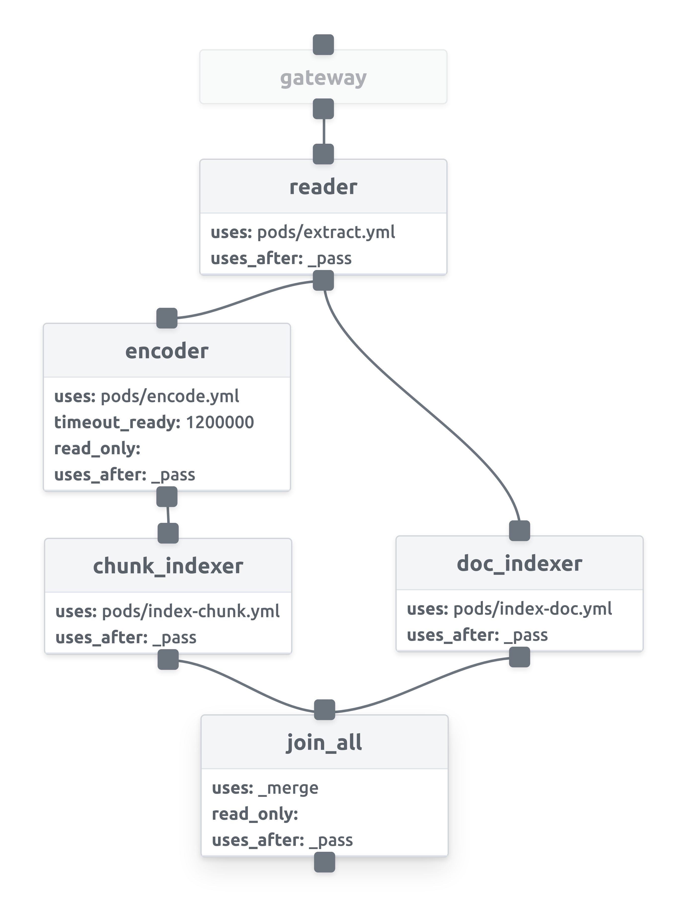

# Build Covid Question Answering Bot

In this demo, we use Jina to build a semantic search system on the [What Are People Asking About COVID-19?](https://openreview.net/pdf?id=qd51R0JNLl). The goal is to find out relevant answers when the user query a similar question. The data contains the questions and answers from various sources.


## Overview

A major challenge during fast-developing pandemics such as COVID-19 is keeping people updated with the latest and most relevant information. Since the beginning of COVID, several websites have created frequently asked questions (FAQ) pages that they regularly update. But even so, users might struggle to find their questions on FAQ pages, and many questions remain unanswered.


## Prerequirements

This demo requires Python 3.7 or 3.8.

```bash
pip install --upgrade -r requirements.txt
```


## Prepare the data

The raw data contains season, episode, character, and line information in the `.csv` format as follows:

```
Category,Question ID,Question,Source,Answers
Speculation - Pandemic Duration,42,will covid end soon,Google Search,"may 1st, i think, is completely unrealistic, said dr. ashish jha, director of the harvard global health institute. , probably for several months. but you might have to do it over and over again, since the outbreak could come in waves. "
Speculation - Pandemic Duration,42,will covid end,Yahoo Search,"may 1st, i think, is completely unrealistic, said dr. ashish jha, director of the harvard global health institute. , probably for several months. but you might have to do it over and over again, since the outbreak could come in waves. "
Speculation - Pandemic Duration,42,when covid will be over,Google Search,"may 1st, i think, is completely unrealistic, said dr. ashish jha, director of the harvard global health institute. , probably for several months. but you might have to do it over and over again, since the outbreak could come in waves. "
Speculation - Pandemic Duration,42,when covid lockdown ends,Google Search,"may 1st, i think, is completely unrealistic, said dr. ashish jha, director of the harvard global health institute. , probably for several months. but you might have to do it over and over again, since the outbreak could come in waves. "
Speculation - Pandemic Duration,42,will covid go away,Google Search,"may 1st, i think, is completely unrealistic, said dr. ashish jha, director of the harvard global health institute. , probably for several months. but you might have to do it over and over again, since the outbreak could come in waves. "
Speculation - Pandemic Duration,42,when covid will end,Yahoo Search,"may 1st, i think, is completely unrealistic, said dr. ashish jha, director of the harvard global health institute. , probably for several months. but you might have to do it over and over again, since the outbreak could come in waves. "

```

Download the data from https://github.com/JerryWei03/COVID-Q/blob/master/final_master_dataset.csv
```


## Define the Flows
### Index
To index the data we first need to define our **Flow** with a **YAML** file.
In the Flow YAML file, we add **Pods** in sequence.
In this demo, we have 5 pods defined with the names `extractor`, `encoder`, `chunk_indexer`, `doc_indexer`, and `join_all`.

However, we have another Pod working in silence.
In fact, the input to the very first Pod is always the Pod with the name **gateway**, the "Forgotten" Pod.
For most of the time, we can safely ignore the **gateway** because it basically does the dirty orchestration work for the Flow.

<table style="margin-left:auto;margin-right:auto;">
<tr>
<td> flow-index.yml</td>
<td> Flow in Dashboard</td>
</tr>
<tr>
<td>
  <sub>

```yaml
!Flow
pods:
  extractor:
    uses: pods/extract.yml
  encoder:
    uses: pods/encode.yml
    timeout_ready: 1200000
    read_only: true
  chunk_indexer:
    uses: pods/index-chunk.yml
  doc_indexer:
    uses: pods/index-doc.yml
    needs: extractor
  join_all:
    uses: _merge
    needs: [doc_indexer, chunk_indexer]
    read_only: true

```

</sub>

</td>
<td>

</td>
</tr>
</table>

By default, the input of each Pod is the Pod defined right above it, and the request message flows from one Pod to another. That's how Flow lives up to its name. Of course, you might want to have a Pod skipping over the Pods above it. In this case, you would use the `needs` argument to specify the source of the input messages. In our example, the `doc_indexer` actually get inputs directly from the `gateway`. By doing this, we have two parallel pathways as shown in the index Flow diagram.

```yaml
doc_indexer:
  uses: pods/index-doc.yml
  needs: gateway
```

As we can see, for most Pods, we only need to define the YAML file path. Given the YAML files, Jina will automatically build the Pods. Plus, `timeout_ready` is a useful argument when adding a Pod, which defines the waiting time before the Flow gives up on the Pod initializing.

```yaml
encoder:
  uses: pods/encode.yml
  timeout_ready: 60000
```

You might also notice the `join_all` Pod has a special YAML path. It denotes a built-in YAML path, which will merge all the incoming messages defined in `needs`.

```yaml
join_all:
  uses: _merge
  needs: [doc_indexer, chunk_indexer]
```

Overall, the index Flow has two pathways, as shown in the Flow diagram. The idea is to save the index and the contents seperately so that we can quickly retrieve the Document IDs from the index and afterwards combine the Document ID with its content.

The pathway on the right side with a single `doc_indexer` stores the Document content. Under the hood it is basically a key-value storage. The key is the Document ID and the value is the Document itself.

The pathway on the other side is for saving the index.
From top to bottom, the first Pod, `extractor`, splits the documents into the sentence (as text) and the character name (as meta info).
Both is stored with the document.
Anyhow, only the text is later encoded into vectors by the `encoder`.
These vectors are saved in a vector storage by `chunk_indexer`.
Finally, the two pathways are merged by `join_all` and the processing of that message is concluded.


### Query
As in the indexing time, we also need a Flow to process the request message during querying.
Here we directly start with the `encoder` with a shorter `timeout_ready` interval, since the model is already prefetched during indexing.
Otherwise, it plays the same role as before, which is encoding the text into vectors.
Later these vectors are used to retrieve the indexed texts by `chunk_indexer`.

<table  style="margin-left:auto;margin-right:auto;">
<tr>
<td> flow-query.yml</td>
<td> Flow in Dashboard</td>
</tr>
<tr>
<td>
  <sub>

```yaml
!Flow
with:
  read_only: true
  port_expose: $JINA_PORT
pods:
  encoder:
    uses: pods/encode.yml
    timeout_ready: 60000
    read_only: true
  chunk_indexer:
    uses: pods/index-chunk.yml
    polling: all
    uses_reducing: _merge_all
  doc_indexer:
    uses: pods/index-doc.yml

```

</sub>

</td>
<td>

</td>
</tr>
</table>


In the last step, the `doc_indexer` comes into play. Sharing the same YAML file, `doc_indexer` will load the stored key-value index and retrieve the matched Documents according to the Document ID.

### Let's take a closer look
Now the index and query Flows are both ready to work. Before proceeding, let's take a closer look at the two Flows and see the differences between them.

Obviously, they have different structures, although they share most Pods.
This is a common practice in the Jina world for the sake of speed.
Except for the `extractor`, both Flows can indeed use identical structures.
The two-pathway design of the index Flow is intended to speed up message passing, because indexing Chunks and Documents can be done in parallel.

Another important difference is that the two Flows are used to process different types of request messages. To index a Document, we send an **IndexRequest** to the Flow. While querying, we send a **SearchRequest**. That's why Pods in both Flows can play different roles while sharing the same YAML files. Later, we will dive deep into into the YAML files, where we define the different ways of processing messages of various types.


## Run the Flows

### Index


```bash
python app.py -t index
```

<details>
<summary>Click here to see the console output</summary>

<p align="center">
  
</p>

</details>

With the Flows, we can now write the code to run the Flow.
For indexing, we start by defining the Flow with a YAML file.
Afterwards, the `load_config()` function will do the magic to construct Pods and connect them together. After that, the `IndexRequest` will be sent to the flow by calling the `index()` function.

```python
def index(num_docs):
    f = Flow().load_config("flow-index.yml")

    with f:
        f.index_lines(
            filepath=os.environ["JINA_DATA_FILE"],
            batch_size=8,
            size=num_docs,
        )
```


The content of the `IndexRequest` is fed from `index_lines()`, which loads the processed `.csv` file.
Encoding the text with bert-family models takes a long time. To save your time, here we limit the number of indexed documents to 500.

### Query

```bash
python app.py -t query
```

<details>
<summary>Click here to see the console output</summary>

<p align="center">
  
</p>

</details>

For querying, we follow the same process to define and build the Flow from the YAML file. The `search_lines()` function is used to send a `SearchRequest` to the Flow. Here we accept the user's query input from the terminal and wrap it into a list of `string`.

```python
def query(top_k):
    f = Flow().load_config("flow-query.yml")
    with f:
        while True:
            text = input("please type a sentence: ")
            if not text:
                break

            def ppr(x):
                print_topk(x, text)
            f.search_lines(lines=[text, ], output_fn=ppr, top_k=top_k)
```

The `callback` argument is used to post-process the returned message. In this demo, we define a simple `print_topk` function to show the results. The returned message `resp` in a Protobuf message. `resp.search.docs` contains all the Documents for searching, and in our case there is only one Document. For each query Document, the matched Documents, `.match_doc`, together with the matching score, `.score`, are stored under the `.topk_results` as a repeated variable.

```python
def print_topk(resp, sentence):
    for d in resp.search.docs:
        print(f"Ta-Dah🔮, here are what we found for: {sentence}")
        for idx, match in enumerate(d.matches):

            score = match.score.value
            if score < 0.0:
                continue
            character = match.meta_info.decode()
            dialog = match.text.strip()
            print(f'> {idx:>2d}({score:.2f}). {character.upper()} said, "{dialog}"')
```

## Dive into the Pods
If you want to know more about Pods, keep reading. As shown above, we defined the Pods by giving the YAML files. Now let's move on to see what is exactly written in these magic YAML files.

### `extractor`
As a convention in Jina, A YAML config is used to describe the properties of an object so that we can easily configure the behavior of the Pods without touching the code.

Here is the YAML file for the `extractor`.
We first use the built-in **TextExtractor** as the **executor** in the Pod.
The `with` field is used to specify the arguments passing to the `__init__()` function.


```yaml
!TextExtractor
with: {}
metas:
  name: extractor
  py_modules: text_loader.py
requests:
  on:
    [SearchRequest, IndexRequest]:
      - !CraftDriver
        with:
          method: craft
```

In the `requests` field, we define the different behaviors of the Pod for different requests.
Remember that both the index and query Flows share the same Pods with the YAML files while they behave differently to the requests.
This is how the magic works: For `SearchRequest`, `IndexRequest`, and, the `extractor` will use the `CraftDriver`.
On the one hand, the Driver encodes the request messages in [Protobuf format](https://en.wikipedia.org/wiki/Protocol_Buffers) into a format that the Executor can understand (e.g. a Numpy array).
On the other hand, the `CraftDriver` will call the `craft()` function from the Executor to handle the message and encode the processed results back into Protobuf format.
For the time being, the `extractor` shows the same behavior for both requests.

### `encoder`
The YAML file of the `encoder` is pretty similar to the `extractor`. As one can see, we specify the `distilbert-base-cased` model. One can easily switch to other fancy pretrained models from **transformers** by giving another `pretrained_model_name_or_path`.

```yaml
!TransformerTorchEncoder
with:
  pooling_strategy: auto
  pretrained_model_name_or_path: distilbert-base-cased
  max_length: 96
```

### `doc_indexer`
In contrast to the Pods above, the `doc_indexer` behave differently depending on different requests. For the `IndexRequest`, the Pod uses `DocPruneDriver` and the `DocKVIndexDRiver` in sequence. The `DocPruneDriver` prunes the redundant data in the message that is not used by the downstream Pods. Here we discard all the data in the `chunks` field because we only want to save the Document level data.

```yaml
!BinaryPbIndexer
with:
  index_filename: doc.gzip
metas:
  name: docIndexer
  workspace: $TMP_WORKSPACE
```

For the `SearchRequest`, the Pod uses the same `DocKVSearchDriver` just like the `IndexRequest`.
```yaml
requests:
  on:
    SearchRequest:
      - !DocKVSearchDriver
      with:
        method: query
```

### `chunk_indexer`
The YAML file for `chunk_indexer` is a little bit cumbersome. But take it easy: It is as straightforward as it should be. The executor in the `chunk_indexer` Pod is called `ChunkIndexer`, which wraps two other executors. The `components` field specifies the two wrapped executors: The `NumpyIndexer` stores the Chunks' vectors, and the `BasePbIndexer` is used as a key-value storage to save the Chunk ID and Chunk details.

```yaml
!CompoundIndexer
components:
  - !NumpyIndexer
    with:
      index_filename: vec.gz
      metric: cosine
    metas:
      name: vecidx  # a customized name
      workspace: $TMP_WORKSPACE
  - !BinaryPbIndexer
    with:
      index_filename: chunk.gz
    metas:
      name: chunkidx  # a customized name
      workspace: $TMP_WORKSPACE
metas:
  name: chunk_indexer
  workspace: $TMP_WORKSPACE

```

Just like the `doc_indexer`, the `chunk_indexer` has different behaviors for different requests. For the `IndexRequest`, the `chunk_indexer` uses three Drivers in serial, namely, `VectorIndexDriver`, `PruneDriver`, and `KVIndexDriver`. The idea is to first use `VectorIndexDriver` to call the `index()` function from the `NumpyIndexer` so that the vectors for all the Chunks are indexed. Then the `PruneDriver` prunes the message, and the `KVIndexDriver` calls the `index()` function from the `BasePbIndexer`. This behavior is defined in the `executor` field. The `requests?` field is not needed from jina 0.5.5 onwards but still needed in jina 0.5.4.

```yaml
requests:
  on:
    IndexRequest:
      - !VectorIndexDriver
        with:
          executor: NumpyIndexer
      - !PruneDriver
        with:
          level: chunk
          pruned:
            - embedding
            - buffer
            - blob
            - text
      - !KVIndexDriver
        with:
          level: chunk
          executor: BasePbIndexer
```

For the `SearchRequest`, the same procedure continues, but under the hood the `KVSearchDriver` and the `VectorSearchDriver` call the `query()` function from the `NumpyIndexer` and `BasePbIndexer` correspondingly.

```yaml
requests:
  on:
    SearchRequest:
      - !VectorSearchDriver
        with:
          executor: NumpyIndexer
      - !PruneDriver
        with:
          level: chunk
          pruned:
            - embedding
            - buffer
            - blob
            - text
      - !KVSearchDriver
        with:
          level: chunk
          executor: BasePbIndexer
```

## Next Steps
- Try other encoders or rankers.
- Run the Pods in docker containers.
- Scale up the indexing procedure.
- Speed up the procedure by using `read_only`
- Provide a Slackbot/Chatbot Interface
- Allow voice input


## License

Copyright (c) 2020 Jina AI Limited. All rights reserved.

Jina is licensed under the Apache License, Version 2.0. See [LICENSE](https://github.com/jina-ai/jina/blob/master/LICENSE) for the full license text.
